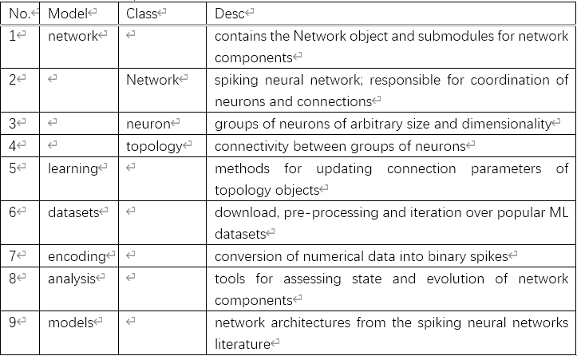
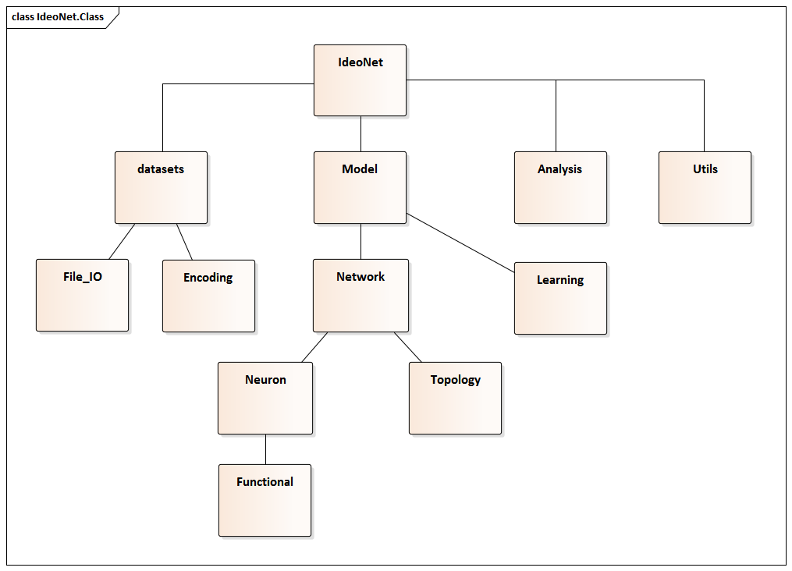
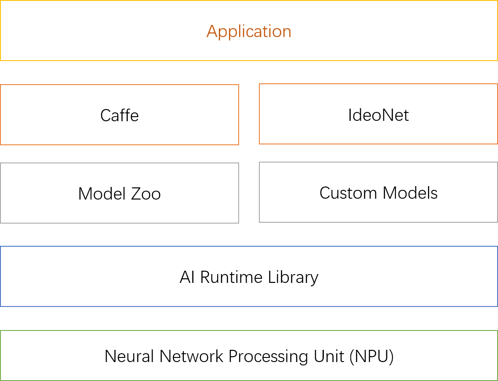

A Python library used for simulating spiking neural networks (SNNs) on CPUs or GPUs using PyTorch Tensor functionality. The library is intended for with correlation based learning methods and adheres to the highly modular and dynamic design of PyTorch.

This library’s power lies in the ease of defining and mixing new Neuron and Connection objects that seamlessly work together, even different versions, in a single network.

IdeoNet is designed to mostly provide low level objects to its user that can be combined and mixed. The biggest difference with PyTorch is that a network now consists of two types of modules, instead of the single nn.Module in regular PyTorch. These new modules are the IdeoNet.Neuron and IdeoNet.Connection.

## Project Structure

## Class

## Plan

